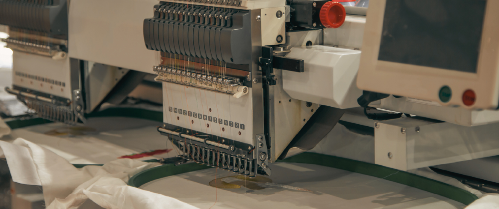

# Sistem Informasi UMKM "Raza Bordir"
<!-- ALL-CONTRIBUTORS-BADGE:START - Do not remove or modify this section -->

<!-- ALL-CONTRIBUTORS-BADGE:END -->

    

Sistem Informasi Manajemen ini dibuat untuk membantu mengelola proses bisnis pada usaha UMKM  milik teman kami. Sistem ini bertujuan untuk menggantikan metode konvensional yang masih menggunakan catatan manual menjadi sistem berbasis komputer yang lebih efisien dan mudah diakses. Dengan adanya sistem ini, diharapkan dapat mempermudah pengelolaan transaksi, akuntansi, serta berbagai kegiatan operasional lainnya, sehingga dapat meningkatkan efisiensi dan mendukung pertumbuhan usaha.

    

---

---

## Tujuan Proyek

Tujuan utama dari proyek ini adalah untuk menggantikan sistem manual yang selama ini digunakan, dengan cara:

- Meningkatkan akurasi dalam pencatatan transaksi dan pembukuan.
- Menghemat waktu dalam pengelolaan dan pembuatan laporan.
- Membantu pemilik usaha untuk lebih mudah memonitor keuangan dan persediaan barang.
- Meningkatkan efisiensi operasional usaha mikro kecil dengan sistem yang terintegrasi dan mudah digunakan.

---

## Dokumentasi Proyek

Terdapat beberapa dokumentasi yang bisa anda lihat sesuai dengan kebutuhan anda.

  

---

## Kontributor

| Nama | GitHub | Peran |
|--|--| -- |
| Farrel Augusta Dinata | [@FarrelAD](https://github.com/FarrelAD) | Frontend & Backend developer |
| Afifah Khoirunnisa | [@afifahnisa17](https://github.com/afifahnisa17) | Database designer |
| Dewita Anggraini | [@DewitaA12](https://github.com/DewitaA12) | UI/UX designer |
| Fajar Aditya Nugraha | [@FajarAdityaNugraha](https://github.com/FajarAdityaNugraha) | UI/UX designer |
| Stevan Zaky Setyanto | [@vanstevanzaky](https://github.com/vanstevanzaky) | Frontend developer |

---
---
## Contributors ✨

Thanks goes to these wonderful people ([emoji key](https://allcontributors.org/docs/en/emoji-key)):

<!-- ALL-CONTRIBUTORS-LIST:START - Do not remove or modify this section -->
<!-- prettier-ignore-start -->
<!-- markdownlint-disable -->
<table>
  <tbody>
    <tr>
      <td align="center" valign="top" width="14.28%"><a href="https://github.com/afifahnisa17"> <b>Afifah Khoirunnisa</b></a> <a href="#data-afifahnisa17" title="Data">🔣</a></td>
    </tr>
  </tbody>
</table>

<!-- markdownlint-restore -->
<!-- prettier-ignore-end -->

<!-- ALL-CONTRIBUTORS-LIST:END -->

This project follows the [all-contributors](https://github.com/all-contributors/all-contributors) specification. Contributions of any kind welcome!